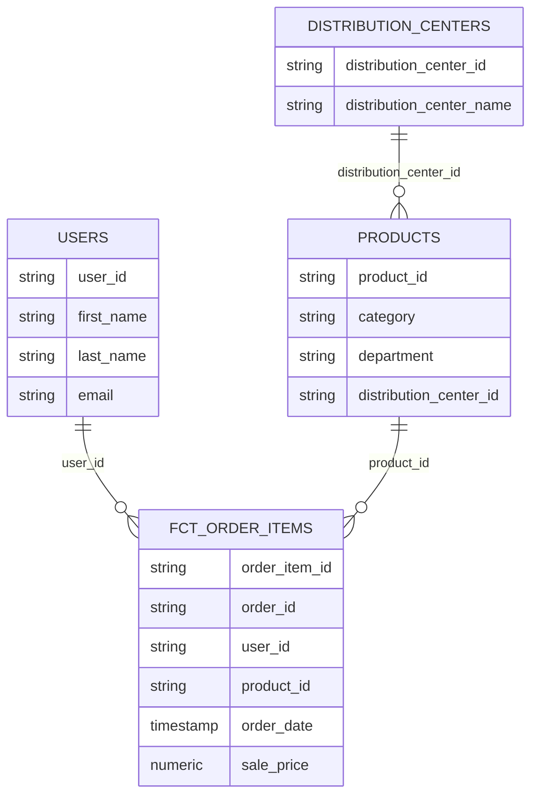

## TheLook dbt analytics project

This repository demonstrates my analytics engineering workflow in dbt on BigQuery. It models the public TheLook ecommerce dataset into clean staging views and business ready marts with testing, documentation and performance in mind.

### Scope
The project reads from the public dataset bigquery-public-data.thelook_ecommerce and writes derived models into development datasets. It standardizes types and naming in staging, builds a fact table for order items and a customer dimension, and enforces data quality through tests.

### Data model
Sources define the public tables. Staging views cast ids to strings, normalize timestamps and expose consistent column names. Marts aggregate the business logic:

fct_order_items is a partitioned and clustered table for efficient analytics at scale. It joins orders, products and distribution centers and surfaces order status, price, product category and logistics attributes.

dim_users rolls up user attributes with lifecycle signals such as first order date and order count. It classifies customers as new or returning.

### Quality and performance
Tests check primary keys, not nulls and referential integrity from facts to dimensions. Partitioning on order_date and clustering by user_id keep queries responsive and cost efficient. Naming, casting and join keys are explicit to avoid type drift and subtle bugs.

### Structure
models/sources contains the public dataset declarations. models/staging contains view level cleanup for orders and users. models/marts contains the fact and dimension with YAML tests. Project configuration sets schemas so staging builds as views and marts as tables.

### Why this design
The layered shape separates concerns. Sources document where data originates. Staging creates a reliable contract for downstream use. Marts express business rules in clear SQL that is easy to review and extend. This mirrors how I ship analytics features in production: small, testable steps with clear ownership.

### What to look at
fct_order_items.sql for the core join logic and storage settings. dim_users.sql for lifecycle metrics built from the fact. The YAML files for testing strategy and model documentation.

### Appendix: run locally (optional)
Prerequisites are a BigQuery project and dbt with the BigQuery adapter. Point your dbt profile at your project and datasets. Then execute:

```bash
cd thelook_ae_project
dbt parse
dbt run --select models/staging
dbt run --select models/marts
dbt test
```

This will read from the public TheLook dataset and build staging views and marts in your development datasets.

### Week 2: Dimensional modeling done right
This phase elevates the project from working SQL to a maintainable analytics warehouse. The focus is a clear star schema, clean staging contracts and analytics tables that answer business questions fast.

Goals
Design a concise star schema around a single transactional fact with descriptive dimensions. Keep staging models one to one with sources and push business logic into marts. Document and test the edges that matter.

Model shape
Fact at the grain of an order item. Dimensions for users, products and distribution centers. Order headers enrich the fact with dates and status. This mirrors how downstream analysis happens: count items, sum revenue, segment by customer and product properties, drill into logistics.



Standards
Staging models only rename, cast and normalize. No joins or aggregates. Marts own the business definitions and denormalization. Consistent naming uses prefixes (stg_, dim_, fct_) and stable keys cast to strings. Partition large facts by order_date and cluster by high‑cardinality keys like user_id.

What I built
Staging views for users and orders that establish stable ids and timestamps. A fact table fct_order_items that joins orders, products and distribution centers, partitioned on order_date and clustered by user_id. A customer dimension dim_users that adds first order date, order counts and a simple customer type classification.

Data quality
Primary keys are unique and not null. Foreign keys from the fact reference dimensions. Source freshness configuration is defined at the source level. Tests run as part of development to prevent regressions.

Definition of done
Every core source has a staging view that compiles without warnings and exposes clearly named columns and correct types. The marts build cleanly in BigQuery and reflect the described star schema. The README and model YAMLs describe intent, important fields and assumptions so another engineer can understand the design quickly.

### Week 3: Tests and documentation
This iteration adds a stronger safety net and better context. Models and key columns are documented. Tests cover keys, relationships and accepted values. A small custom test ensures prices are never negative. The docs site renders a clear lineage from sources to marts so a reviewer can trace how numbers are produced.
